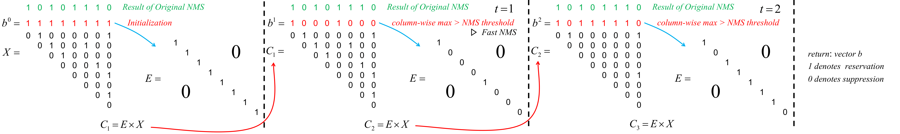

Fast NMS 
--- 
首先，对每个类别的前n个得分计算一个c×n×n的IoU矩阵X，并且对每个类别的框降序排序，且X是对角线元素为1的对角矩阵，所以将X的下三角和对角线区域设置为0。其次，保留列方向上的最大值，来计算每个检测器的最大IoU矩阵K。最后，医用阈值t（K<t）来处理矩阵K，对每个类别保留最优的检测器。    

Cluster NMS
---
其实就是一个迭代式的Fast NMS。前面的过程与Fast NMS一模一样，都是B按得分降序排序，计算IoU矩阵，上三角化。然后取列队大致，经过阈值二值化得到一维张量b。丹不同于Fast NMS直接输出了b，Cluster NMS而是利用b，将它展开诚一个对角矩阵E，也就是这个对角矩阵E的对角线元素与b相同。然后用E取左乘IoU矩阵X。然后再按列取最大值，NMS阈值二值化得到一个新的一维张量，重复上面的操作，直到出现某两次迭代后，张量b爆出不变，则得到最终的得分。

！[image](cluster-nms02.png)  

  

Fast NMS相比于传统的NMS速度更快，但是精度有所损失，Cluster NMS因为有迭代操作，速度介于Fast NMS与传统NMS之间，但是其精度与传统NMS一样。
